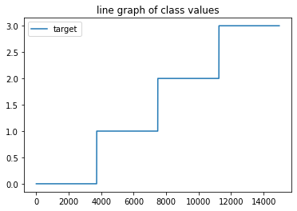

# **2D Shape Recognition**

Adarsh Baghel (180001001)

Ubaid Shaikh (180001050)

* * *

# INTRODUCTION:

The study of shapes is a recurring theme in computer vision. As shape is one of the main sources of information that can be used for object recognition, recognizing shapes is an essential task in computer vision, especially in understanding digital images and image flows. A wide spectrum of application areas relies on shape recognition, including robotics, healthcare, security systems, assistance for the impaired. Characterizing the shape of a specific rigid object is not a particularly hard problem, although using the shape information to solve perceptual tasks is not easy.

Our problem statement is to build a 2D Shape recognizer which could recognize common 2D Shapes. Our approach is successfully able to recognize Square, Circle, Triangle and Star.

# 

# DATASET USED:

* * *

**Four Shapes (From Kaggle)**

**16,000 images of four basic shapes (star, circle, square, triangle)**

This dataset contains 16,000 images of four shapes; square, star, circle, and triangle. Each image is 200x200 pixels.

The data was collected using a Garmin Virb 1080p action camera. The shapes were cut from poster board, and then painted green. I held each shape in view of the camera for two minutes. While the camera was recording the shape, I moved the shape around and rotated it.

The four videos were then processed using OpenCV in Python. Using colorspaces, the green shape is cropped out of the image and resized to 200x200 pixels. The data is arranged into four folders; square, circle, triangle, and star. The images are labeled 0.png, 1.png, etc…

## 

Fig: Original dataset images

# METHODOLOGY:

* * *

We should first pre-process the given images. We should remove any noises in the image, adjust its intensity level and convert the images to binary format.

As a first step we always need to apply some filtering or preprocessing to enhance our datasets.

Here the concepts learned in CV courses come under action. 

We apply a gaussian filter with ( mask_size = 9, sigma=20 ):

Since we need to remove the extra points or noise which are around the shape objects, we apply a gaussian filter to them.

fig: results after applying gaussian filter

Now as the next step we need to binarize the image to black and white pixels

"""Otsu’s thresholding attempts to be dynamic and automatically computes the

 optimal threshold value based on the input image."""

 thresh = cv2.threshold(img_copy, 0, 255, cv2.THRESH_BINARY + cv2.THRESH_OTSU)[1]

After converting to a black and white image, we then find contours, to basically find the bounding box and the ROI region of interest.

# Find contours, obtain bounding box, extract and save ROI (Region of Interest)

 contours, hierarchy = cv2.findContours(thresh, cv2.RETR_TREE, cv2.CHAIN_APPROX_SIMPLE)

Finding ROI and the corresponding image section from the original image with some offset.

 ROI = []

 for c in contours:

     offset = 5

     x,y,w,h = cv2.boundingRect(c)

     x = x-offset

     y = y-offset

     w += 2*offset

     h += 2*offset

     ROI = cv2.resize(thresh[y:y+h, x:x+w], (25,25), interpolation = cv2.INTER_AREA)

We finally get images like these corresponding to the shape.

<table>
  <tr>
    <td></td>
    <td></td>
    <td></td>
    <td></td>
  </tr>
</table>

Now these newly formed images becomes the base of our further experimentations.

## APPROACH 1:

As discussed in [2], we can find the shape factor of the figure in the given image. Then, by using the shape factor, and comparing the shape factor lies in which range, we can determine the shape of the given figure.

The final step is to recognize each labeled region from the other similar regions by counting the shape factor parameter, shape factor use to recognizes the labeled region whether it is regular shape or not, and what is the type(s) of this shape(s) if it is regular shape. This can be achieve by using the following relation:

Shape Factor = Area / Diameter^2

Where the area is the area of labeled region, and the diameter is the maximum distance between two pixels in a labeled region (in the boundary of labeled region). Value of shape factor indicates a specific type of shape

For detecting the Area can be counted by just counting the no. of ones in the image, and the diameter can be found by finding the edges/contour of the image shape and then finding the maximum distance between two pixels.

## APPROACH 2:

Using Guassian based probabilistic Learning approach:

After getting the processed dataset in the form of a csv file. We are now ready to use machine learning techniques for shape detection.

### Dataset Exploration: 

Mapping string class values to integers

<table>
  <tr>
    <td>First Dataset Image</td>
    <td>Last Dataset Image</td>
  </tr>
  <tr>
    <td></td>
    <td></td>
  </tr>
</table>

### Naive Bayes Classifier:

We have used a naive bayes classifier. The Naive Bayes classifier works on the principle of conditional probability, as given by the Bayes theorem. The Bayes theorem gives us the conditional probability of event A, given that event B has occurred.

Naive Bayes learners and classifiers can be extremely fast compared to more sophisticated methods. The decoupling of the class conditional feature distributions means that each distribution can be independently estimated as a one dimensional distribution. This in turn helps to alleviate problems stemming from the curse of dimensionality.

GaussianNB implements the Gaussian Naive Bayes algorithm for classification. The likelihood of the features is assumed to be Gaussian:

Splitting the dataset into training data and testing data

Testing Set: To test the generalization capability of the learning algorithm, it must be tested over a set of instances not seen during training. This set of instances is called validation set or the testing set. The instances on the validation set should be labeled, so when the trained algorithm is tested with an instance on the validation set it can be known if the output is right or wrong.

Training and testing our model

Using LDA to project the data into a 3D space to improve accuracy

Plotting confusion matrix

# RESULTS:

### Approach 1:

It was only applicable to certain types of shapes like square, rectangle, circle and triangle. It wasn’t able to best suit the shape like a **star **which resembles mostly like the triangle, having similar area and diameter^2.

According to our analysis these were the best ranges of shape factor

<table>
  <tr>
    <td>shape_factor_ranges = [
  [0.2, 0.3, "rectangle"], 
  [0.38, 0.54, "triangle"], 
  [0.54, 0.65, "square"], 
  [0.65, 0.8, "circle"], 
  [np.NINF, np.inf, "unrecognized"]
]</td>
  </tr>
</table>

Results on 100 images dataset

considering only squares, triangles and circles. we achieved an approximate accuracy of 90%

<table>
  <tr>
    <td>actual: square , predicted:  dict_values([[0.48875739644970406, 'triangle']42
actual: square , predicted:  dict_values([[0.5866666666666666, 'square']42
actual: square , predicted:  dict_values([[0.5987525987525988, 'square']42
actual: circle , predicted:  dict_values([[0.7628865979381444, 'circle']42
actual: triangle , predicted:  dict_values([[0.5093555093555093, 'triangle']42
actual: square , predicted:  dict_values([[0.5450819672131146, 'square']42
actual: triangle , predicted:  dict_values([[0.48681541582150095, 'triangle']42
actual: circle , predicted:  dict_values([[0.7405940594059407, 'circle']42
actual: triangle , predicted:  dict_values([[0.45601436265709155, 'triangle']42
actual: circle , predicted:  dict_values([[0.7799145299145298, 'circle']42
actual: circle , predicted:  dict_values([[0.775257731958763, 'circle']42
actual: triangle , predicted:  dict_values([[0.49799999999999994, 'triangle']42
actual: square , predicted:  dict_values([[0.5672131147540984, 'square']42
actual: circle , predicted:  dict_values([[0.754639175257732, 'circle']42
actual: triangle , predicted:  dict_values([[0.4428822495606327, 'triangle']42
actual: square , predicted:  dict_values([[0.5481335952848723, 'square']42
actual: square , predicted:  dict_values([[0.5738255033557048, 'square']42

accuracy:  0.9090909090909091
</td>
  </tr>
</table>

### Approach 2:

Using the Gaussian Naive Bayes Classifier, we obtained a very good accuracy of 0.996259684744857

The confusion matrix is as follows:

After projecting the data into 3D space using Linear Discriminant Analysis (LDA) and then using the Gaussian Naive Bayes Classifier, we obtained a perfect accuracy score of 100.

The confusion matrix is as follows:

Visualizing some randomly picked images, with their true and predicted label

### Segmenting the Image:

Given Image:

Gray Scaled Image:

Binarized Image:

Canny Edge Detected Image:

Contours detected Image:

Detecting Shape:

Interesting Note for bounding box detection:

<table>
  <tr>
    <td>Without gaussian filter:</td>
    <td>With Gaussian filter:</td>
  </tr>
  <tr>
    <td>
	    
</td>
    <td>
	    
</td>
  </tr>
  <tr>
    <td>We can see that the bounding box for star is not found correctly</td>
    <td>We can see that the bounding box for all the shapes is found correctly</td>
  </tr>
</table>

# CONCLUSION:

In this Project we suggested 

**Approach 1:** to detect the shape(s) in an image, also the algorithm recognize the type of shape(s). The algorithm has good ability to detect most shapes in

image and separate its prior to recognize. This work have ability to recognize all the known

(regular) shapes via determine the shape factor which suggested for this purpose. In comparing with other

works this algorithm recognize almost all shapes type, while most of other works focuses on recognizing

specific shapes. The algorithm work fine and give very promise results.

**Approach 2:** to detect the shape(s), we used gaussian naive bayes classifier. We ¾ of the dataset for training the model and ¼ of the dataset for testing. Using LDA and projecting the data, we reached a perfect accuracy score of 100. The gaussian bayes classifier model is a great model to solve this problem. For more complex problems such as optical character recognition or face recognition, complex models such as neural networks or support vector should be used instead.

# REFERENCES

1.  S. Gomez, "Shape recognition using machine learning,” 2011 6th Colombian Computing Congress (CCC), 2011, pp. 1-3, doi: 10.1109/COLOMCC.2011.5936308.

2.  El Abbadi, Nidhal & Saadi, Lamis. (2013). Automatic Detection and Recognize Different Shapes in an Image.

* * *

Thank You

